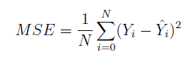
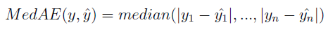
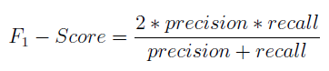
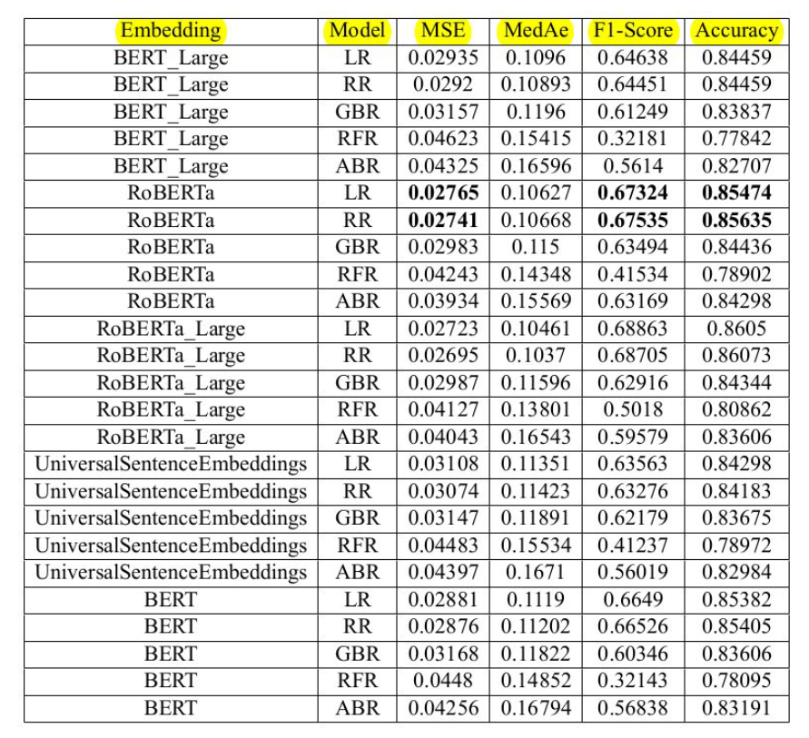

# Clickbait Strength Prediction and control

This repository contains the code implementation of paper titled[**"Predicting Clickbait Strength in Online Social Media"**](https://aclanthology.org/2020.coling-main.425.pdf) published in 28th International Conference on Computational Linguistics(COLING-2020).

1) The aim of this project is to predict the intensity of clickbait and identify the words/phrases in the headline that actually make it clickbaity. The goal is to come up with a way to increase or decrease the clickbait intensity by substituting these words.
2) Used various regression algorithms (linear, ridge , random forest, gradient/adaboost) with various contextual word embedding techniques such as BERT, RoBERTa, and Universal Sentence Embeddings for predicting the intensity and a paraphrase model for reducing the intensity.

## Dataset

We use the Webis Clickbait Corpus, which contains tweets and their clickbait intensities that are manually annotated by the annotators. Along with the tweets (post text) and intensity scores it also contains other
attributes like timestamp, target paragraph, target keywords, class(clickbait/non clickbait), mean, median and mode values of the intensity scores given by the annotators.

| Field                                | Train  | Test   |
|--------------------------------------|--------|--------|
| Number of samples in the data       | 17,506 | 4,341  |
| Number of click bait samples        | 4,281  | 1,104  |
| Maximum sequence length              | 267    | 476    |
| Minimum sequence length              | 1      | 1      |
| Average sequence length              | 12     | 11     |
| Minimum Intensity                    | 0      | 0      |
| Maximum Intensity                    | 1      | 1      |
| Average Intensity                    | 0.327  | 0.331  |
| Total number of words               | 206,521| -      |
| Total number of unique words        | 39,231 | -      |

## Evaluaion Metrics

### Mean Squared Error
Mean Squared Error(MSE) is the main evaluation metric as we would be using regression techniques to measure the intensity of the clickbaityness of the text. MSE is computed using the following formula.

Here, Yi is ground truth value of sample-i, Yi^ is the value predicted by the model for sample-i and N is the total number of samples in the dataset.

### Median Absolute Error
The median absolute error is particularly interesting because it is robust to outliers. The loss is calculated by taking the median of all absolute differences between the target and the prediction. If y^ is the predicted value of the ith sample and yi is the corresponding true value, then the median absolute error estimated over n samples is defined as follows:

### F1-score
For classifying the headline as clickbait or not we are going to use F1-Score metric. It is the standard classification task metric that balance both precision and recall. F1-Score is computed using the formula
below.

Here, Precision quantifies the number of positive class predictions that actually belong to the positive class and Recall quantifies the number of positive class predictions made out of all positive examples in
the dataset. Since we are predicting the intensity of the clickbait, which outputs a real number between 0 and 1, to compute the F1-Score, the headlines with intensity score greater than 0.5 are considered to be
clickbait and the rest are considered as non clickbait.

### Accuracy
![Accuracy][(Images/Accuracy.png)]
Accuracy is one of the popular metric that is used for classification. It is defined as the percentage of samples that are correctly classified by the model and is given by the formula given below.

## Benchmarks

